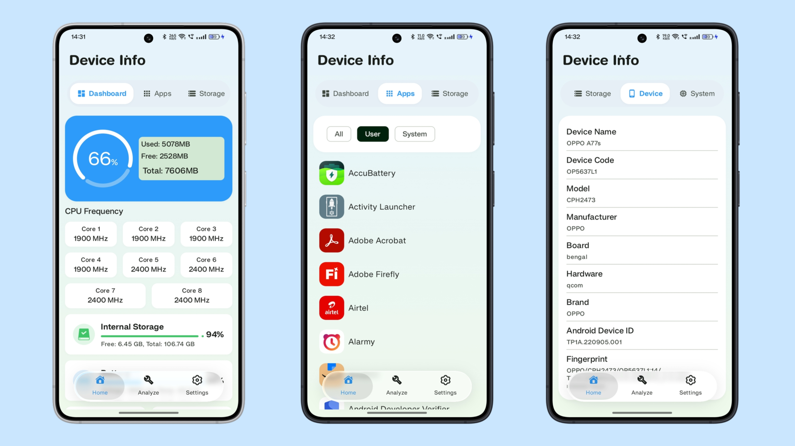
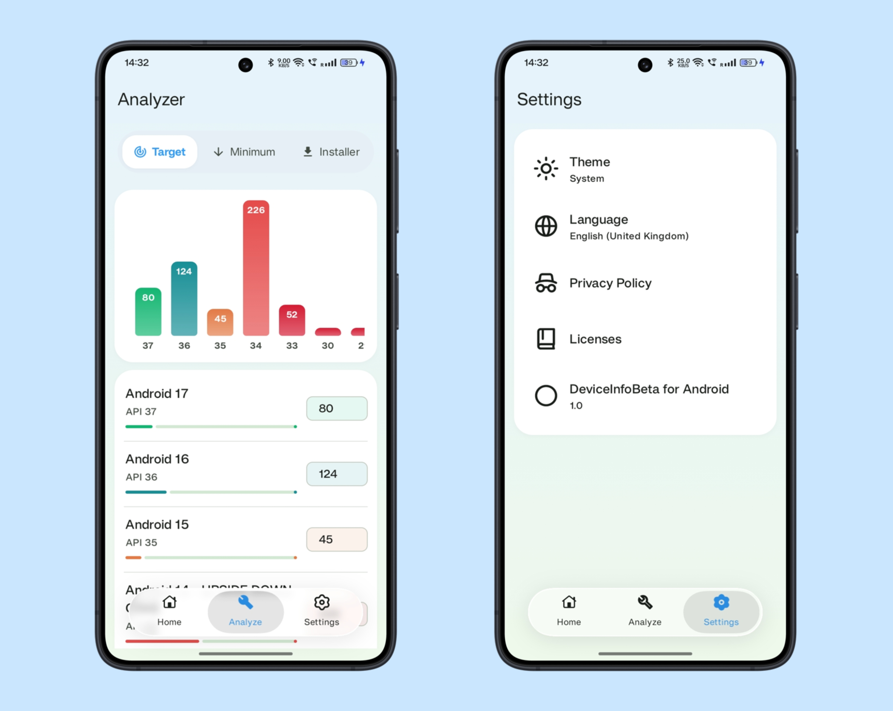

# Device Info - Know Your Android Device

Device Info is an Android application that provides detailed information about the device it is installed on. The application leverages Android's various APIs to collect and display information such as installed apps, device hardware details, system specifications, and more.




## Features

- **Device Information**: Displays details about the device including model, manufacturer, OS version, and more.
- **App Analysis**: Provides information about installed applications, including components, target and minimum API levels, installers, and signatures.
- **Hardware Details**: Shows detailed information about the device's CPU, battery, display, camera, sensors, storage, and memory.
- **Storage Widget**: A resizable home screen widget showing storage usage.

## Installation

To build and install the application, follow these steps:

1. Clone the repository:
```sh
   git clone https://github.com/overandoutnerd/DeviceInfo.git
```
2. Open the project in Android Studio.
3. Add your own `google-services.json` to the `app/` folder. Register the package `com.overandoutnerd.deviceinfo` in Firebase to get one.
4. Build the project and run it on an Android device or emulator.

## Usage

Once the application is installed, you can navigate through the various tabs to access different sections:

- **Home**: View a dashboard and details for installed apps, storage, device, system, processor, battery, display, camera, and sensors.
- **Analyze**: Group installed apps by target API, minimum API, installer, and signature.
- **Settings**: Manage app settings such as theme (Light, Dark, System) and language (English, Hindi).

## Dependencies

The project includes several dependencies, which are managed using Gradle. Key dependencies include:

- AndroidX libraries for Compose, Navigation, Lifecycle, Glance, and WorkManager.
- Google's Mobile Ads SDK for ad integration (ads are off by default, see `show_ads` in `bools.xml`).
- Firebase Auth (not used yet).

For a full list of dependencies, refer to the `build.gradle.kts` file.

## Contributing

Contributions are welcome! To contribute:

1. Fork the repository.
2. Create a new branch for your feature or bugfix.
3. Commit your changes.
4. Push to your branch and create a pull request.

## License

This project is licensed under the MIT License.

## Contact

For any questions or suggestions, feel free to open an issue on the repository or contact the maintainer.

---
 